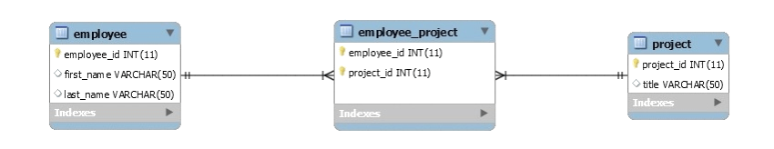

# Web App Security

## Many to Many Relationship
This is an example of the relationship between employees and projects

To create a many-to-many relationship, we need to:
1. Database Setup
2. Use Model Classes
 
Also, you can create mappings using Hibernate's many-to-many annotations, which is a more convenient counterpart compared to creating XML mapping files.

## This World of Ours
The writer points were about security especially authentication. For example, you have to use a strong password for your e-mail and accounts, and never share it with others, because it can lead for bad results such as hacking, criminal issues and even political purposes.

